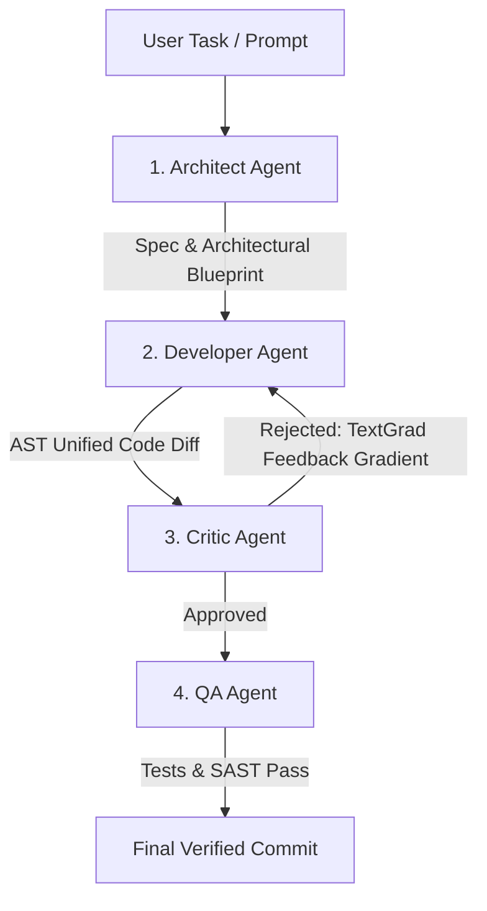

# INDEX0 AI — Sovereign AGI Operating System
## Complete Project Overview, Backend Connectivity, Agent Roster & Master Plan

---

## Executive Summary

**INDEX0 AI** is a sovereign, self-hosted, multi-agent AI software engineering operating system designed as a zero-lock-in alternative to closed AI coding ecosystems (Cursor, Devin, v0, OpenHands). It unites local and cloud developer interfaces with hardware-isolated execution, git-native cryptographic coordination, real-time voice, and a self-evolving 4-tier code review loop.

---

## 1. System Topology & Backend Connectivity

```text
┌─────────────────────────────────────────────────────────────────────────────────┐
│                                CLIENTS & ENTRYPOINTS                            │
├────────────────────┬────────────────────┬───────────────────┬───────────────────┤
│   🖥️ index0 CLI    │  🧩 VS Code Ext    │ 🌐 Web IDE/Canvas │ 💻 Next.js Portal │
│ (@index0/client-   │ (@index0/ide-      │ (code-server:8443 │ (apps/ai:3005 at  │
│  harness)          │  extension)        │  at ide.index0.in)│  ai.index0.in)    │
└─────────┬──────────┴─────────┬──────────┴─────────┬─────────┴─────────┬─────────┘
          │                    │                    │                   │
          ▼                    ▼                    ▼                   ▼
┌─────────────────────────────────────────────────────────────────────────────────┐
│              SOVEREIGN CADDY REVERSE PROXY GATEWAY (ai.index0.in / :80, :443)   │
└────────────────────────────────────────┬────────────────────────────────────────┘
                                         │ Reverse Proxies to Internal Services:
     ┌──────────────────┬────────────────┼────────────────┬──────────────────┐
     ▼                  ▼                ▼                ▼                  ▼
┌──────────┐     ┌─────────────┐  ┌─────────────┐  ┌─────────────┐    ┌────────────┐
│ LiteLLM  │     │   Agent     │  │   Sandbox   │  │  Zitadel    │    │  Temporal  │
│ Gateway  │     │Orchestrator │  │   Manager   │  │    Auth     │    │ Workflows  │
│  (:4000) │     │   (:8000)   │  │   (:4001)   │  │   (:8085)   │    │  (:7233)   │
└────┬─────┘     └──────┬──────┘  └─────────────┘  └─────────────┘    └────────────┘
     │                  │
     ▼                  ▼
Azure OpenAI       TextGrad
(GPT-4o/Mini)   Backpropagation
```

### A. How the CLI Connects to the Backend

The `index0` CLI is implemented in `packages/client-harness`:

1. **Authentication & Identity (`src/auth.ts`)**:
   - Uses GitHub OAuth Device Code Flow (Client ID `Ov23li8VyEodaOqcZqTH`) and Zitadel OIDC token exchange (`/auth`).
   - Caches JWT access tokens securely at `~/.index0/credentials.json`.
   - Verified with GitHub identity `@Pavandarivemula1`.

2. **Inference & Model Routing (`src/engine.ts`)**:
   - Dispatches LLM queries to `POST https://ai.index0.in/v1/chat/completions`.
   - The Gateway forwards this to **LiteLLM**, which routes directly to managed Azure OpenAI instances (`azure-gpt-4o` and `azure-gpt-4o-mini`).
   - Equipped with stdout ANSI/token sanitization (`filter.ts`) saving up to ~68% token overhead.

3. **Autonomous Review Loop (`src/engine.ts`)**:
   - Calls `POST https://ai.index0.in/orchestrator/cycles/start` on the **Agent Orchestrator**.
   - Includes graceful offline fallback logic (`local matrix mode`) when disconnected from the cloud.

4. **Git-Native Sandboxing (`src/worktree.ts`, `src/gnap.ts`)**:
   - Automatically provisions isolated Git worktrees (`.git/worktrees/`) for agent code generation so working directory state remains untouched until approved.
   - Commits diffs with cryptographic GNAP metadata in git history (`.gnap/`).

---

### B. What Else Connects to the Backend?

1. **VS Code Extension (`apps/ide/extension`)**:
   - Connects to `https://ai.index0.in` for:
     - Autonomous agent runs (`/api/v1/agents/runs`).
     - GhostText inline completions (TabbyML / local edge autocomplete).
     - MCP (Model Context Protocol) tool inspection (`/sandbox`, `/mcp`).
     - WebRTC Voice Agent rooms.

2. **Cloud Web IDE & Autonomous Workbench (`apps/ide/web` & `agent-canvas`)**:
   - Hosted at `https://canvas.index0.in` and `https://ide.index0.in`.
   - Reverse-proxied via Caddy to containerized `code-server:8443`.
   - Powered by the rebranded `index0_agent` runtime (formerly OpenHands) running inside Docker/Firecracker execution sandboxes.

3. **Landing & Downloads Portal (`apps/ai`)**:
   - Next.js 15 application running on port 3005 at `ai.index0.in`.
   - Serves the universal one-line installers (`/install.sh`, `/install.ps1`, and `index0-cli.tar.gz`).
   - Handles billing checkouts via Lago and OpenMeter (`/api/billing`).

4. **Storage & Infrastructure Backbone (`infra/compose/docker-compose.yml`)**:
   - **PostgreSQL 16**: Central database for Zitadel, Lago, Temporal, and OpenMeter.
   - **ClickHouse**: Columnar telemetry engine for audit logs and token consumption analytics.
   - **Apache Kafka**: High-throughput event queue bridging OpenMeter to ClickHouse.
   - **Temporal.io**: Distributed workflow engine executing long-running agent loops.

---

## 2. Complete Agent Ecosystem

INDEX0 uses two complementary agent tiers:

### Tier 1: The 4-Tier Self-Evolving Review Matrix (`services/agent-orchestrator`)

Managed via a LangGraph state machine (`src/graph/review_loop.py`), this matrix enforces strict quality gates on all code generation:



1. 🏗️ **Architect Agent (`src/graph/nodes/architect.py`)**:
   - Analyzes codebase context, technical constraints, and user intent.
   - Outputs a formal structural specification, required file changes, and potential blast radius before code generation begins.

2. 💻 **Developer Agent (`src/graph/nodes/developer.py`)**:
   - Translates the Architect's specification and any previous Critic feedback into concrete, AST-aligned code modifications.
   - Outputs standardized unified git diffs.

3. 🧐 **Critic Agent (`src/graph/nodes/critic.py`)**:
   - Evaluates the diff against security guidelines, syntax rules, and anti-slop criteria.
   - If flawed, invokes the **TextGrad Feedback Engine** (`src/textgrad/feedback_engine.py`) to compute textual backpropagation gradients that instruct the Developer on exact corrections.

4. 🧪 **QA Agent (`src/graph/nodes/qa.py`)**:
   - Executes unit tests, integration tests, linters, and SAST security scanners in an isolated environment.
   - Ensures zero compiler regression before final approval.

---

### Tier 2: Autonomous Workbench Execution Agents (`agent-canvas/index0_agent/agenthub`)

Specialized runtime agents that execute complex interactive tasks inside microVM and Docker sandboxes:

1. ⚙️ **CodeAct Agent**:
   - Executes terminal actions, runs commands, reads shell output, inspects compiler logs, and modifies files iteratively.

2. 🌐 **Browsing Agent**:
   - Controls a headless Chromium browser to validate web apps, inspect DOM elements, and automate end-to-end tests.

3. 🗺️ **Planner Agent**:
   - Decomposes massive engineering goals into ordered, verifiable execution milestones.

4. 🤝 **Delegator Agent**:
   - Evaluates incoming tasks and dynamically assigns sub-tasks to the best specialized worker agent.

---

### Tier 3: Multimodal Real-Time Voice Agent (`services/voice-agent`)

- **LiveKit + Pipecat Audio Pipeline**:
  - Sub-100ms real-time conversational agent operating over WebRTC.
  - VAD (Silero) → STT (Whisper) → LLM (Azure OpenAI via LiteLLM) → TTS (ElevenLabs).
  - Directly accessible inside the IDE and Web Workbench for hands-free voice coding.

---

## 3. The 6 Sovereign Capability Layers & 4 Pillars

```text
┌──────────────────────────────────────────────────────────────────────────────────┐
│                      INDEX0 SOVEREIGN AGI ARCHITECTURE                           │
├──────────────────────────────────────────────────────────────────────────────────┤
│ 🎙️ 1. Voice & Multimodal Layer   → LiveKit Agents + Pipecat (Sub-100ms WebRTC)   │
│ ⚡ 2. Edge & GhostText Layer      → TabbyML + vLLM (Sub-20ms Local Autocomplete) │
│ 🔒 3. MicroVM Execution Sandbox   → Firecracker + E2B Cloud (Hardware Isolation)  │
│ 🐙 4. Git-Native Agent Protocol   → GNAP + Postcard (Decentralized Git State)    │
│ 🧠 5. Context Compression & Memory→ OpenViking + Letta MemGPT + LiteLLM Proxy     │
│ 🔄 6. Self-Evolving Review Loop   → LangGraph 4-Tier + TextGrad Backpropagation  │
├──────────────────────────────────────────────────────────────────────────────────┤
│                         FOUNDATIONAL PILLARS                                     │
│  BUILD: OpenHands Workbench | SHIP: Temporal + Coolify                           │
│  SELL:  OpenMeter + Lago    | GROW: Twenty CRM + PostHog                         │
└──────────────────────────────────────────────────────────────────────────────────┘
```

---

## 4. Monorepo Map & Port Matrix

| Directory / Package | Description | Exposed Port / Domain |
| :--- | :--- | :--- |
| `packages/client-harness` | `index0` Developer CLI & TUI engine | Standalone terminal binary |
| `packages/contracts` | Shared TypeScript schemas & GNAP types | Internal npm package |
| `packages/mcp-host` | Model Context Protocol host (`viking://`) | STDIO / IPC |
| `apps/ai` | Next.js platform landing & download portal | `:3005` (proxied to `ai.index0.in`) |
| `apps/ide/web` | Web IDE UI & Workbench visualizer | `:5173` (proxied to `/ide`) |
| `apps/ide/extension` | VS Code / Cursor IDE Extension | Desktop & Code-OSS |
| `agent-canvas` | Rebranded OpenHands autonomous runtime | `:8443` (`canvas.index0.in`) |
| `services/agent-orchestrator` | LangGraph 4-tier review service | `:8000` (proxied to `/orchestrator`) |
| `services/voice-agent` | Real-time LiveKit / Pipecat service | `:8020` |
| `services/sandbox-manager` | Docker & MicroVM isolation controller | `:4001` (proxied to `/sandbox`) |
| `infra/gateway` | Caddy reverse proxy on Azure VM | `:80`, `:443`, `:8000` (`20.106.136.209`) |
| `infra/litellm` | OpenAI-compatible proxy & budget manager | `:4000` (proxied to `/v1`) |
| `infra/zitadel` | Sovereign OIDC Identity Provider | `:8085` (proxied to `/auth`) |
| `infra/lago` | Usage-based billing & subscription engine | `:3000` / `:3001` |
| `infra/openmeter` | Real-time token event metering | `:8888` |
| `infra/temporal` | Distributed workflow orchestration & UI | `:7233` (gRPC), `:8233` (UI) |

---

## 5. Master Roadmap & Strategic Plan

### Phase 1: Sovereign Foundation (COMPLETED ✅)
- [x] Monorepo workspace initialized with pnpm, Turborepo, TypeScript, and Python.
- [x] Docker Compose stack configured (PostgreSQL, ClickHouse, Kafka, Temporal, Zitadel, Lago, OpenMeter).
- [x] Caddy Gateway configured with SSL, security headers, and reverse proxy routing.
- [x] Azure OpenAI credentials routed through LiteLLM (`azure-gpt-4o`, `azure-gpt-4o-mini`).

### Phase 2: Agent Orchestration & Workbench (COMPLETED ✅)
- [x] 4-Tier LangGraph review loop built (Architect, Developer, Critic, QA).
- [x] TextGrad textual backpropagation feedback engine implemented.
- [x] OpenHands codebase rebranded and aligned to native `index0_agent` and `agent-canvas`.
- [x] Terminal Token Filter implemented to strip ANSI escapes and compress execution logs.

### Phase 3: CLI, Cloud VM & Distribution (COMPLETED / ACTIVE ✅)
- [x] Azure VM deployed at `20.106.136.209` (`ai.index0.in`).
- [x] GitHub Device Code OAuth flow verified with `@Pavandarivemula1`.
- [x] Git worktree sandboxing and TUI status boxes built into `index0` binary.
- [x] Distribution scripts (`install.sh`, `install.ps1`, `index0-cli.tar.gz`) hosted directly on the gateway.

### Phase 4: Current Execution Plan (IMMEDIATE NEXT STEPS 🚀)

1. **Gateway Route Alignment**:
   - Align `/orchestrator/*` routing in `infra/gateway/Caddyfile` so CLI requests to `/orchestrator/cycles/start` strip the prefix and reach FastAPI without 404s.
2. **CLI Package Distribution**:
   - Tag version `v0.1.0` and publish `@index0/cli` to npm and GitHub Releases.
3. **VS Code Extension Packaging**:
   - Package `apps/ide/extension` into a `.vsix` bundle for single-click installation on VS Code and Cursor.
4. **End-to-End Live Workflow Verification**:
   - Run a live command: `index0 run "fix billing test"` directly from terminal, verifying:
     - GitHub OAuth check.
     - Worktree creation.
     - 4-Tier LangGraph review loop execution in Azure.
     - Clean AST diff generation and signed GNAP commit.
